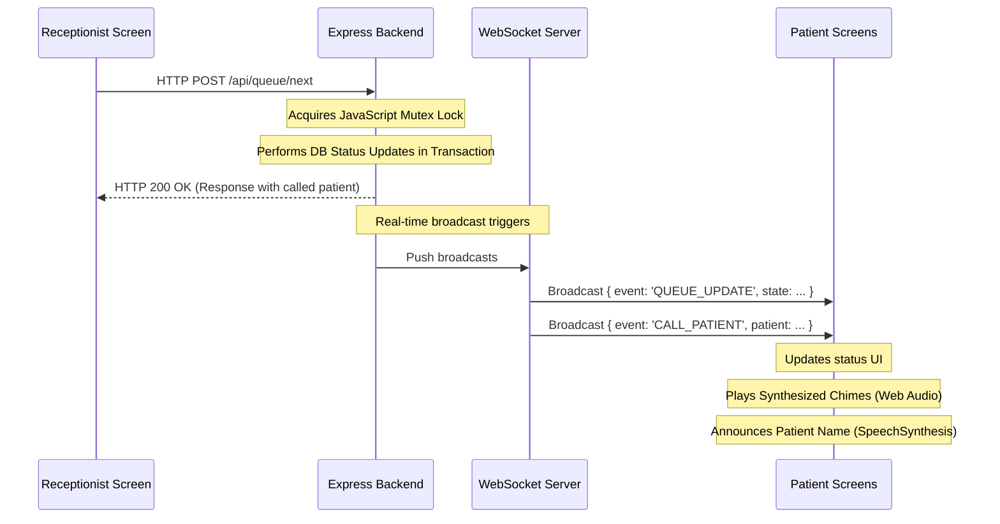

<<<<<<< HEAD
# Queue Cure '26

Queue Cure '26 is a modern, real-time clinic queue management system designed to replace traditional paper-token systems. It features instant synchronization between the receptionist desk and patient waiting room screens.

---

## 🌟 Key Features

* **Real-time Live Sync:** Uses native HTML5 WebSockets on the frontend and Node's `ws` on the backend to synchronize state changes immediately across all screens without reloading.
* **Concurrency Locking (Mutex):** Prevents duplicate "Call Next" operations when multiple receptionists are active.
* **Dynamic Wait Time Estimator:** Wait times are calculated in real time based on actual queue size and editable average consultation time setting:
  $$\text{Estimated Wait Time} = \text{Tokens Ahead} \times \text{Average Consultation Time}$$
* **Accessibility voice Calls:** Features built-in Audio Chime synthesis and HTML5 Speech Synthesis (Text-to-Speech) announcements for patient calls.
* **Personalized Patient Tracker:** Patients can enter their token number to track their live status, position ahead of them, and custom wait times.
* **Persistent SQLite Database:** Retains queue history and system configurations across restarts.
* **Daily Token Resetting:** Automatically resets token numbers to `1` at the beginning of each calendar day.

---

## 🛠️ Tech Stack

* **Backend:** Node.js, Express, `ws` (WebSockets), `sqlite3` (database).
* **Frontend:** HTML5, Vanilla JavaScript, Vanilla CSS (using variable-based theme, transitions, and glassmorphic panels).
* **Sound & Voice:** Web Audio API (Synthesizer chimes), Web Speech Synthesis API.

---

## 📂 Project Structure

```text
Queue Cure '26/
├── package.json
├── server.js                 # Express + WebSocket Server
├── db.js                     # SQLite Database connection & helpers
├── public/                   # Frontend assets served by Express
│   ├── index.html            # Gateway Landing Page
│   ├── shared/
│   │   └── common.css        # Shared styles, CSS variables, & animations
│   ├── receptionist/
│   │   ├── index.html        # Receptionist Dashboard
│   │   ├── style.css         # Receptionist Custom Styles
│   │   └── app.js            # Receptionist Controller
│   └── patient/
│       ├── index.html        # Patient Waiting Room
│       ├── style.css         # Patient Waiting Room Styles
│       └── app.js            # Patient Waiting Room Controller
├── Dockerfile                # Container configurations
├── docker-compose.yml        # Multi-container local deployment
└── README.md                 # Project documentation
```

---

## 💾 Database Schema

The SQLite database (`queue.db`) contains two primary tables:

### 1. `patients`
| Column | Type | Constraints | Description |
|---|---|---|---|
| `id` | INTEGER | PRIMARY KEY AUTOINCREMENT | Unique record ID |
| `token_number` | INTEGER | NOT NULL | Daily sequential token ID |
| `patient_name` | TEXT | NOT NULL | Patient's name |
| `phone_number` | TEXT | NULL | Optional phone |
| `status` | TEXT | CHECK(status IN ('WAITING', 'IN_CONSULTATION', 'COMPLETED', 'SKIPPED')) | Current patient state |
| `consultation_start` | DATETIME | NULL | Timestamp when consultation starts |
| `consultation_end` | DATETIME | NULL | Timestamp when consultation finishes |
| `consultation_duration` | INTEGER | NULL | Total consultation length in seconds |
| `created_at` | DATETIME | DEFAULT CURRENT_TIMESTAMP | Date and time registered |

### 2. `settings`
| Column | Type | Constraints | Description |
|---|---|---|---|
| `id` | INTEGER | PRIMARY KEY CHECK(id = 1) | Enforces single settings row |
| `average_consultation_time` | INTEGER | NOT NULL DEFAULT 5 | Estimated minutes per visit |

---

## 🔌 API Endpoints Reference

All endpoints return JSON responses.

### Patients
* **`POST /api/patients`**
  Registers a new patient. Auto-generates the next sequential token number for the day.
  * **Body:** `{ "patient_name": "John Doe", "phone_number": "555-0199" }` (phone is optional)
  * **Success (201):** `{ "id": 1, "token_number": 1, "patient_name": "John Doe", "phone_number": "555-0199" }`
* **`POST /api/patients/:id/complete`**
  Marks patient status as `COMPLETED` and calculates consultation duration.
  * **Success (200):** `{ "success": true }`
* **`POST /api/patients/:id/skip`**
  Marks patient status as `SKIPPED`.
  * **Success (200):** `{ "success": true }`
* **`POST /api/patients/:id/recall`**
  Broadcasts a `RECALL_PATIENT` alert for the specific patient.
  * **Success (200):** `{ "success": true }`
* **`POST /api/patients/:id/start-consultation`**
  Sets patient status to `IN_CONSULTATION` and logs the consultation start timestamp.
  * **Success (200):** `{ "success": true, "consultation_start": "2026-06-12T06:00:00Z" }`
* **`POST /api/patients/:id/end-consultation`**
  Sets patient status to `COMPLETED`, logs the end timestamp, and stores the computed duration.
  * **Success (200):** `{ "success": true, "consultation_end": "...", "consultation_duration": 320 }`

### Queue Operations
* **`GET /api/queue`**
  Returns the complete active queue state.
  * **Success (200):** `{ "waitingList": [], "activePatient": {}, "completedList": [], "stats": {}, "settings": {} }`
* **`POST /api/queue/next`**
  Advances the queue: sets the current consultation to `COMPLETED` and calls the next `WAITING` patient in chronological sequence. Utilizes a mutex lock to reject duplicate calls.
  * **Success (200):** `{ "success": true, "calledPatient": { ... } }`
  * **Busy (409):** `{ "error": "Another queue advancement is in progress" }`
  * **Empty (400):** `{ "error": "No patients waiting" }`
* **`POST /api/queue/recall-previous`**
  Recall operation: Pulls the last completed/skipped patient back to `IN_CONSULTATION` (moving the current active patient back to `WAITING` if exists) and triggers a broadcast voice/audio alert.
  * **Success (200):** `{ "success": true, "recalledPatient": { ... } }`

### Operations & Analytics
* **`GET /api/analytics?period=today|weekly|monthly`**
  Returns aggregated registrations, completions, average waits, average durations, and peak hourly volumes.
  * **Success (200):** `{ "stats": { ... }, "registrationsOverTime": [], "completionsOverTime": [], "avgWaitTrend": [], "avgDurationTrend": [], "peakHours": [] }`
* **`GET /api/history?query=&status=&date=`**
  Searchable list of historic patient consultation logs.
  * **Success (200):** `[ { "id": 1, "token_number": 1, "patient_name": "...", "status": "COMPLETED", ... } ]`

### Settings & Demo Control
* **`POST /api/settings`**
  Updates the system-wide average consultation time (in minutes).
  * **Body:** `{ "average_consultation_time": 8 }`
  * **Success (200):** `{ "success": true, "average_consultation_time": 8 }`
* **`POST /api/demo/populate`**
  Clears patient table and seeds mock data spread over the last 30 days and today.
  * **Success (200):** `{ "success": true }`
* **`POST /api/demo/start`**
  Starts background demo queue advancement simulation.
  * **Success (200):** `{ "success": true, "isDemoActive": true }`
* **`POST /api/demo/stop`**
  Stops background demo queue advancement simulation.
  * **Success (200):** `{ "success": true, "isDemoActive": false }`

---

## 🌐 WebSocket Message Structures

WebSockets are used downstream to notify frontend clients of database changes. Clients connect to the server at: `ws://<host>` (or `wss://<host>`).

### 1. `INITIAL_STATE` (To connecting client)
Sent immediately upon socket connection. Contains full active queue, settings, and statistics.
```json
{
  "event": "INITIAL_STATE",
  "state": {
    "waitingList": [...],
    "activePatient": {...},
    "completedList": [...],
    "stats": { "totalToday": 5, "waiting": 3, "completed": 1, "currentServing": 2 },
    "settings": { "average_consultation_time": 5 }
  }
}
```

### 2. `QUEUE_UPDATE` (Broadcast)
Sent when the queue state changes (additions, skips, completions, setting adjustments).
```json
{
  "event": "QUEUE_UPDATE",
  "state": { ... }
}
```

### 3. `CALL_PATIENT` (Broadcast)
Sent when the receptionist moves a patient into consultation. Triggers audio chime and TTS voice synthesis.
```json
{
  "event": "CALL_PATIENT",
  "patient": {
    "token_number": 5,
    "patient_name": "Alice Smith"
  }
}
```

### 4. `RECALL_PATIENT` (Broadcast)
Sent during a token recall. Plays chime and a "Recalling..." voice synthesis.
```json
{
  "event": "RECALL_PATIENT",
  "patient": {
    "token_number": 5,
    "patient_name": "Alice Smith"
  }
}
```

---

## ⚙️ Event Flow Diagram



---

## 🚀 Getting Started

### Prerequisites
* Node.js v18.0.0+ (Tested on v24.12.0)
* npm (Tested on 11.7.0)

### 1. Installation
Clone or navigate to the project directory, then run:
```bash
npm install
```

### 2. Running Locally
Start the server in development mode:
```bash
npm run dev
```
Open [http://localhost:3000](http://localhost:3000) in your web browser.

### 3. Testing Concurrency Locks
We have bundled a test suite to verify the atomic queue locks. Run the test script:
```bash
node scratch/test_concurrency.js
```
*(This will launch a temporary test server, fire 5 concurrent calls, verify that only 1 succeeds and 4 return 409 Conflict, and close gracefully).*

---

## 🐳 Deployment (Docker & Compose)

The application includes a ready-to-run container configuration.

### Dockerfile
Build the image locally:
```bash
docker build -t queue-cure-26 .
```
Run the container:
```bash
docker run -p 3000:3000 -v queue_data:/app queue-cure-26
```

### Docker Compose
Start the application with persistent volumes:
```bash
docker-compose up -d
```
The application will be accessible at [http://localhost:3000](http://localhost:3000), and `queue.db` will persist inside the Docker volume.
=======
# Queue-Cure
>>>>>>> d21eb3955774249d23931475a9374086dc28dc3e
